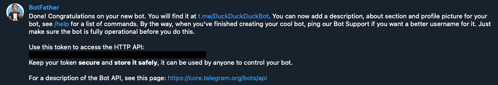
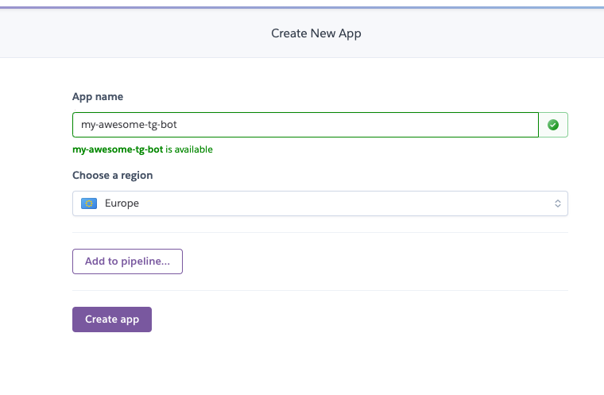
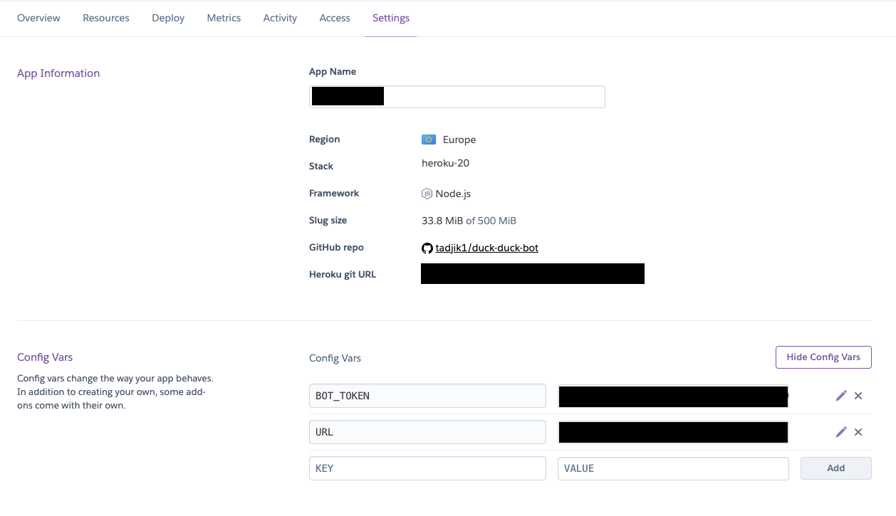
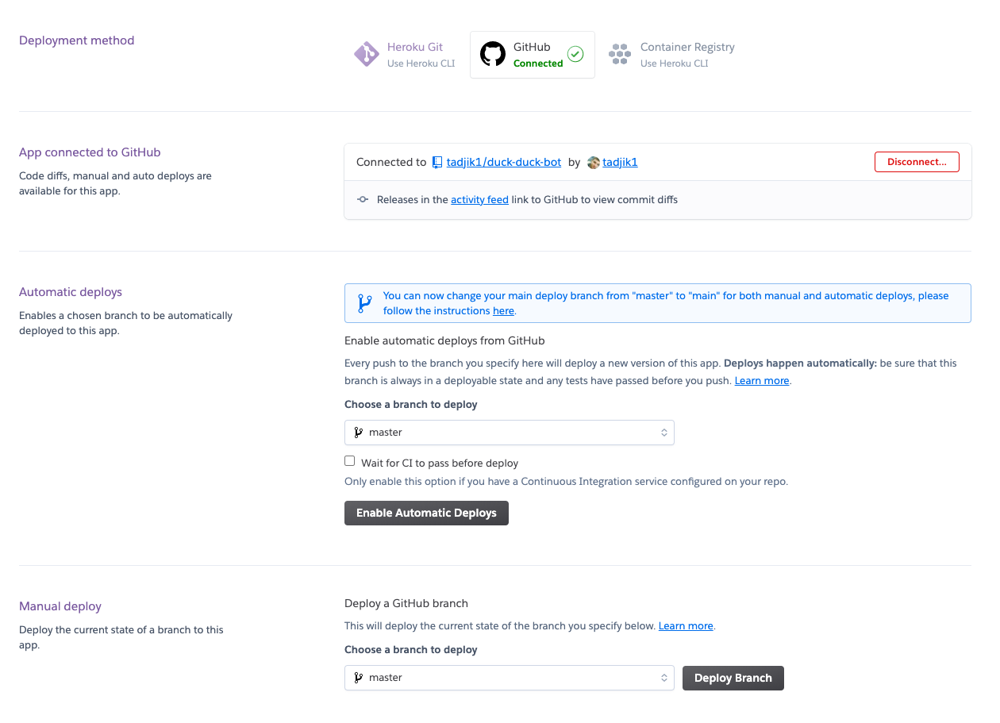

# Duck duck duck bot

Hey, this is a simple example of [telegram bot](https://t.me/DuckDuckDuckBot), having received a sticker, replies 
with the random sticker from the same sticker pack.

This Node.JS application uses [Koa](https://koajs.com/), [Telegraf](https://telegraf.js.org/) and deployed to 
[Heroku](https://www.heroku.com/).

## Create your own bot

1. Fork this repository.
2. Register new bot using [BotFather](https://t.me/BotFather).
   You should choose the name and username of the bot. As a result you will be given special token that can be used
   to access Telegram API.
   

   
Your bot has been created

    
   
    
   

3. Create new application in [heroku dashboard](https://dashboard.heroku.com/apps).
   Again you should choose the name (it can be the same name you were using for the telegram bot).
   

   
Create new application

   

   

4. Set environment variables in Heroku dashboard. Go to "Settings", and press button "Reveal Config Vars" in "Config 
   Vars" section. Here you should specify 2 variables:
   - `BOT_TOKEN` with the token you got from BotFather in step 1;
   - `URL` with the value heroku automatically generates for your application (it's typically 
     `https://YOUR_APPLICATION_NAME.herokuapp.com`)
   

   
Config Vars

   

   

5. You are ready to deploy your own bot! Go to the `Deploy` section:
   - Deployment method - Github
   - App connected to Github - Type the name of the repository ("duck-duck") and hit "Search", then click "Connect".
   - Automatic deploys - Enable Automatic Deploys (this will automatically deploy changes after each push into the repo).
   - Manual deploy - press "Deploy Branch"
   

   
Deployment

   

   

    
AAAAAaaaand that's it! Hoooray! After short time you will be able to see succesful deployment and you can send messages
to your own very first telegram bot!

